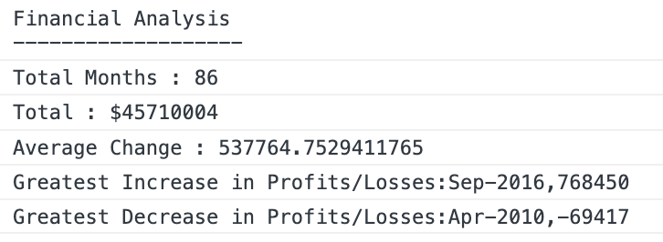

# JavaScript Fundamental : Console Finances  

Code for analyzing the financial records

## About

Given : a dataset composed of arrays with two fields, Date and Profit/Losses.

Task :write JavaScript code that analyzes the records to calculate each of the following:

* The total number of months included in the dataset.

* The net total amount of Profit/Losses over the entire period.

* The average of the changes in Profit/Losses over the entire period.

* The greatest increase in Profit/Losses (date and amount) over the entire period.

* The greatest decrease in Profit/Losses (date and amount) over the entire period.

All data to be logged in console

## CREDIT

## OUTCOME

[GitHub]()

View the project :

## LICENSE 
MIT

## CONTACT 
noeamelyaofficial@hotmail.com