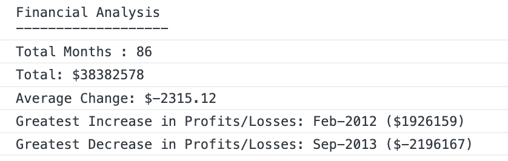

# JavaScript Fundamental : Console Finances  

Code for analyzing the financial records

## About

Given : a dataset composed of arrays with two fields, Date and Profit/Losses.

Task :write JavaScript code that analyzes the records to calculate each of the following:

* The total number of months included in the dataset.

* The net total amount of Profit/Losses over the entire period.

* The average of the changes in Profit/Losses over the entire period.

* The greatest increase in Profit/Losses (date and amount) over the entire period.

* The greatest decrease in Profit/Losses (date and amount) over the entire period.

All data to be logged in console

## Information 

- Function : 

[sum array](https://developer.mozilla.org/en-US/docs/Web/JavaScript/Reference/Global_Objects/Array/map)

[Format number](https://stackoverflow.com/questions/149055/how-to-format-numbers-as-currency-strings)

[Difference between two array](https://stackoverflow.com/questions/1187518/how-to-get-the-difference-between-two-arrays-in-javascript)

- Useful link :

[JavaScript Loops](https://www.w3schools.com/js/js_loop_for.asp)

[Pseudo Code Practice Problems](https://computersciencewiki.org/images/e/ea/Pseudo_Code_Practice_Problems.pdf)

## OUTCOME

[GitHub](https://github.com/noeamelya/Console-Finances)

View the project :

## LICENSE 
MIT

## CONTACT 
noeamelyaofficial@hotmail.com